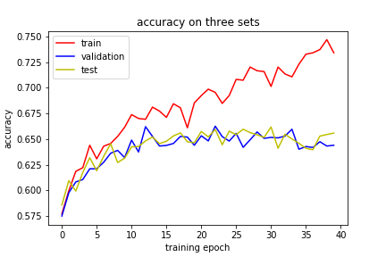
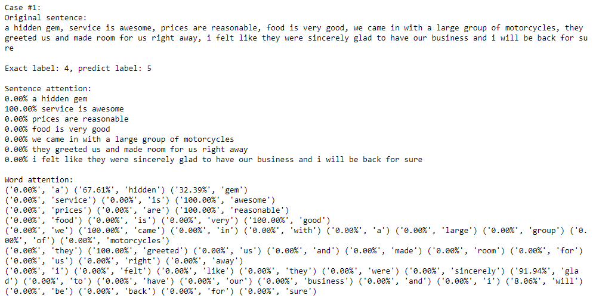
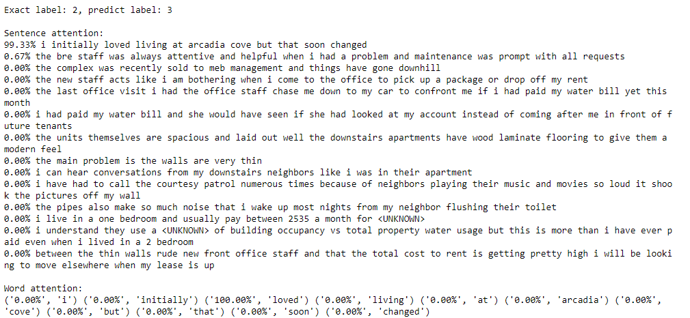

# Hierarchical Attention Networks
My implementation for "[Hierarchical Attention Networks for Document Classification](http://www.cs.cmu.edu/~./hovy/papers/16HLT-hierarchical-attention-networks.pdf)" (Yang et al. 2016)

Data from Yelp is downloaded from [Duyu Tang's homepage](http://ir.hit.edu.cn/~dytang/) (the same dataset used in Yang's paper)  
Download link: http://ir.hit.edu.cn/~dytang/paper/emnlp2015/emnlp-2015-data.7z

1. Put data in a directory named "data/yelp_YEAR/" (where "YEAR" is the year)  
2. Run "yelp-preprocess.ipynb" to preprocess the data. The format becomes "label \t\t sentence1 \t sentence2...".  
3. Then run "word2vec.ipynb" to train word2vec model from training set.  
4. Run "HAN.ipynb" to train the model.  
5. Run "case_study.ipynb" to run visualization of some examples from validation set, including attention vector(sentence-level and word-level) and the prediction results.  

Now we get about 65% accuracy on the yelp2013 test set. After fine-tuning hyperparameters, it can be better.

## Hyperparameters we used
epoches | batch size | GRU units | word2vec size | optimizer | learning rate | maximum sentence length
------- | ---------- |---------- |-------------- |---------- |-------------- | -----------------------
 50     | 32         | 128       | 50            | Adam      | 4e-4          | 200

## Training Process

 
 ## Accuracy we currently get on Yelp2013 dataset
train   | validation | test
------- | ---------- |-----
66.891% | 64.659%    | 64.734%

## Typical Examples
### 1. Successful case: (capture the key sentence "service is awesome" and key word "awesome")
  

### 2. Failed case: (capture the keyword "loved" but ignore the context "initially")

